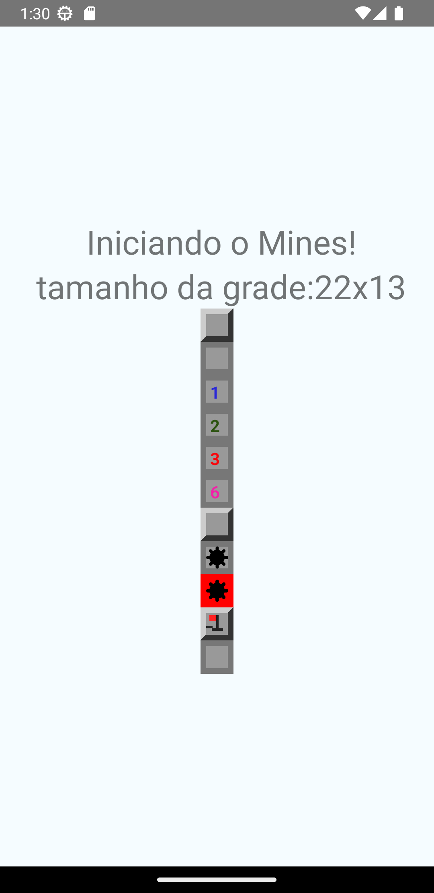
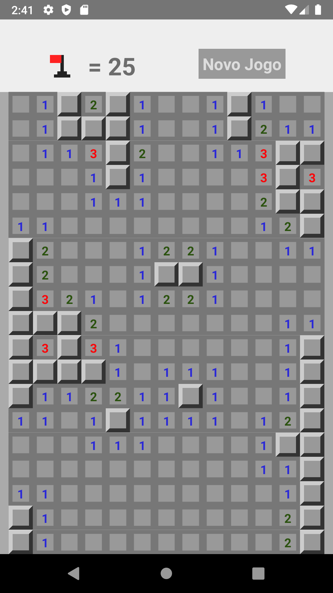
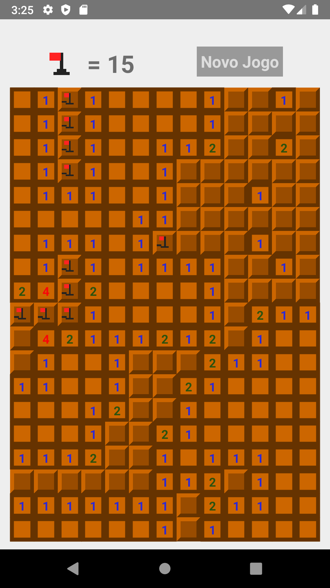
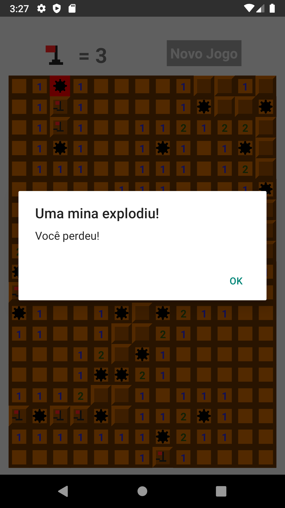

# MineFiled_Mobile_START

App mobile com o jogo Campo Minado, feito acompanhado de um cruso de React-Native,  e melhorado de acordo com minhas ideias,
app feito com o propósito de obter experiência e conhecimento em React Native e Java Script. O jogo segue as regras padrões
do campo minado clássico.

## Capturas de Tela

